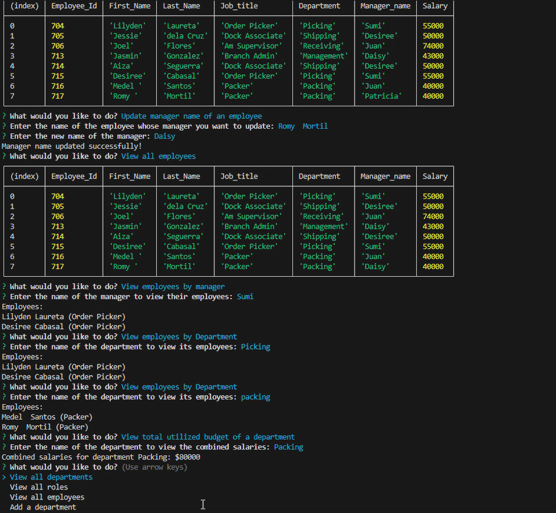

# Employee Tracker Challenge    

## Table of Contents
- [Description](#description)
- [Installation](#installation)
- [Usage](#usage)
- [Contributors](#contributing)
- [Tests](#tests)
- [License](#license)
- [Questions](#questions)

## Description
This application is a command line application that manages a company's employee database using Node, Inquirer and MySql. Through this, user can view, delete, update and filter informations based on selected command.

## Installation
To install this application, clone this repository to your local machine, navigate to the project directory: Employee Tracker challenge and install the dependencies.

## Usage
Once installed, you can run the generator by command 'npm start' to terminal. Follow the prompts and provide necessary details.

## Contributing
Contributors are welcome! If you encounter issues or have any suggestions, open an issue to GitHub.

## Questions
  My GitHub profile is: Jenina52112 [View on GitHub](https://github.com/Jenina52112)

  For additional questions, contact me at email address: jeninadelacruz521@yahoo.com

